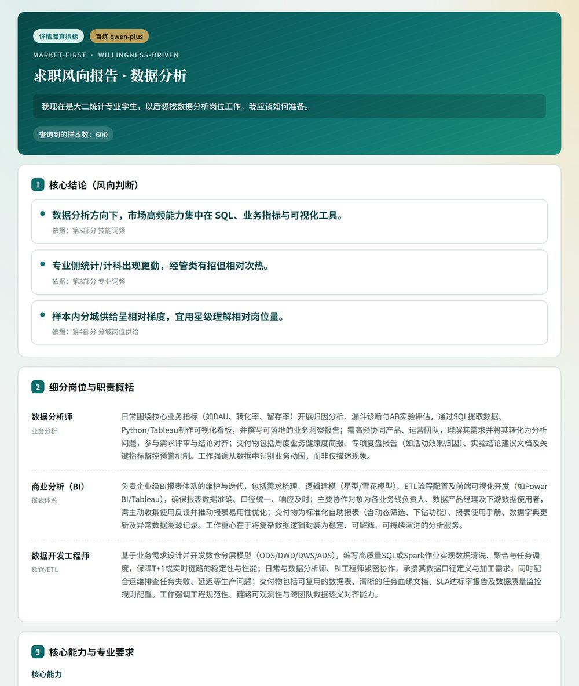
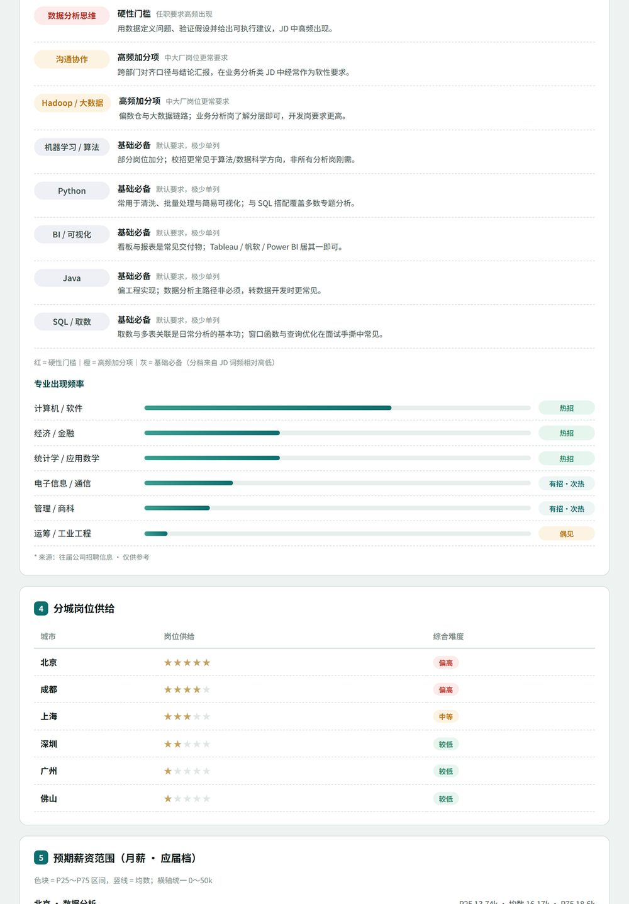
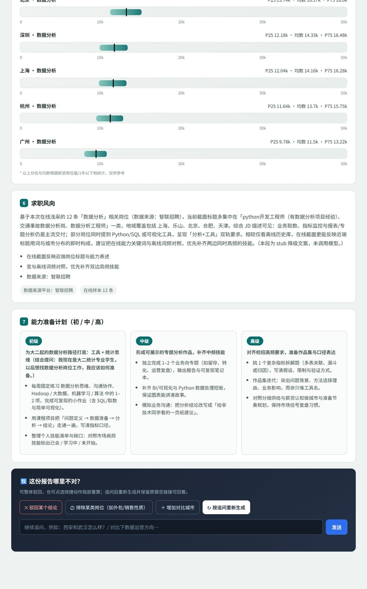

# 求职风向 Agent

**方向还没定清时，先看市场要什么，再谈怎么准备。**

面向校招前期的 Market-first 助手：你说出想去的方向，系统用岗位样本统计技能词频、分城供给、应届薪资等信号，再生成一份可核对依据的风向报告与分阶段准备计划。个人背景只作约束过滤，不做专业/简历匹配，也不做海投或改简历。



## 快速开始

需本机已安装 Python 3.10+，以及阿里云百炼（DashScope）API Key。

```bash
git clone https://github.com/youngys012345-ai/Career-planning-agent.git
cd Career-planning-agent

python -m venv .venv
# Windows: .venv\Scripts\activate
# macOS / Linux: source .venv/bin/activate

pip install -r requirements.txt
cp .env.example .env   # Windows 可用: copy .env.example .env
```

编辑 `.env`，填入：

```text
DASHSCOPE_API_KEY=你的密钥
```

启动本地服务：

```bash
# macOS / Linux
WIND_AGENT_ENV=dev python scripts/serve_wind_agent.py

# Windows PowerShell
$env:WIND_AGENT_ENV="dev"; python scripts/serve_wind_agent.py
```

浏览器打开 [http://127.0.0.1:8766](http://127.0.0.1:8766) ，输入意愿方向即可生成报告。

## 你能得到什么

| 模块 | 说明 |
|------|------|
| 核心结论 | 风向判断，并写明依据来自报告哪一部分 |
| 细分岗位与职责 | 该方向下常见子岗与职责概括 |
| 技能与专业要求 | 基于岗位样本的技能 / 专业词频 |
| 分城供给 | 相对强弱星级，辅助选城 |
| 预期薪资 | 应届 / 低年限档分位示意 |
| 能力准备计划 | 初 / 中 / 高三阶段可执行项 |
| 人在回路 | 觉得某块不对可反馈后局部重算 |





## 和别的求职工具差在哪

| | 求职风向 Agent | 常见求职工具 |
|--|----------------|--------------|
| 时机 | 投递前：定方向 / 调方向 / 前期准备 | 多已定方向后的简历、投递、面试 |
| 驱动 | 市场岗位信号优先 | 专业 / 简历匹配优先 |
| 数字 | 代码统计；模型只解读、不编造 | 易黑箱「推荐你去某司」 |
| 不做 | 海投、ATS 改简历、测评式人岗匹配主路径 | 往往覆盖中后段执行 |

## 工作原理

先用本地知识库与统计代码算出 Evidence Pack（词频、供给、薪资等数字只在这里产生），再调用百炼模型只读 Pack 写职责、结论与准备计划，最后渲染为 HTML 报告；你可对局部结论反馈并重算。

## License

Apache-2.0
